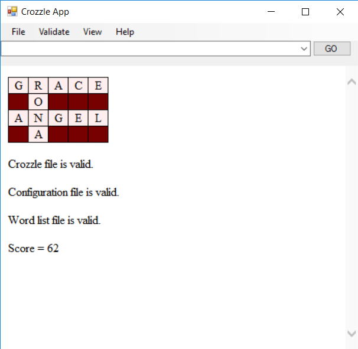

## Introduction

This is a simple GUI crozzle application created using .NETFramework v4.6.1 and C#. The application uses an optimisation technique - Greedy Algorithm to quickly generate the "highest" scoring crozzle for a given word list.

## Instructions To Use

The application requires three sets of files - namely Crozzle.txt, Configuration.txt and Wordlist.txt (look _Demo Files_ folder). Users can access the Crozzle.txt files locally using _File_ tab or through the Internet via input field box.

The score for a crozzle can be generated under _Validate_ tab.

Similarly errors are displayed under _View_ tab.
